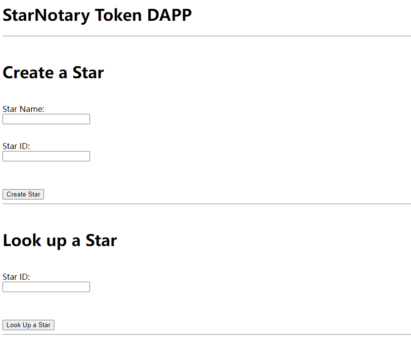
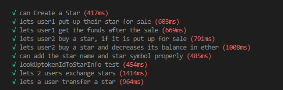

# Ethereum CryptoStar Dapp

Ethereum CryptoStar Dapp is a smart contract that is used to register the star and notarize.

- User could register a star as a non-fungible token (ERC-721)
- User could transfer the star to another user. 
- User can search the stars

- Truffle version = v5.1.65
- Ganache version = 2.5.4.1367
- OpenZeppelin version = 2.1.2
- ERC-721 Token Name = ShibaInuStar
- ERC-721 Token Symbol = SBS
- Rinkeby Network has been deprecated by Infura.
- truffle-hdwallet-provider has been deprecated by Truffle.

## Task 1

- Add a function lookUptokenIdToStarInfo, that looks up the stars using the Token ID, and then returns the name of the star.

- Add a function called exchangeStars, so 2 users can exchange their star tokens...Do not worry about the price, just write code to exchange stars between users.

- Write a function to Transfer a Star. The function should transfer a star from the address of the caller. The function should accept 2 arguments, the address to transfer the star to, and the token ID of the star.

## Task 2

- The token name and token symbol are added properly.

- 2 users can exchange their stars.

- Stars Tokens can be transferred from one address to another.

## Task 3

- Deploy your Contract to Rinkeby, but Rinkeby, Ropsten, and Kovan testnets are deprecated from the Infura API.

## Task 4

- Modify the front end of the DAPP to achieve the following: