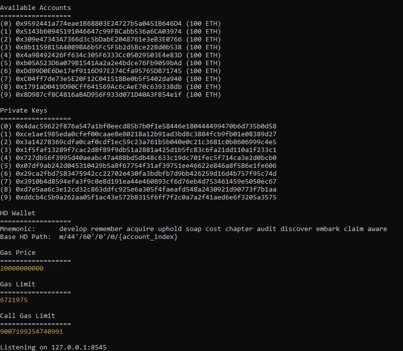
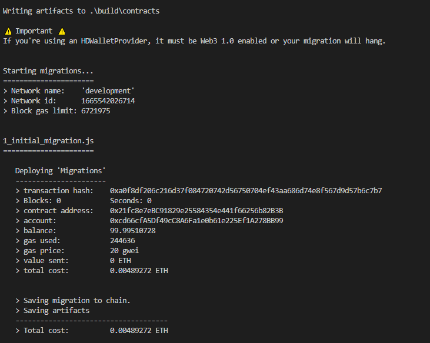
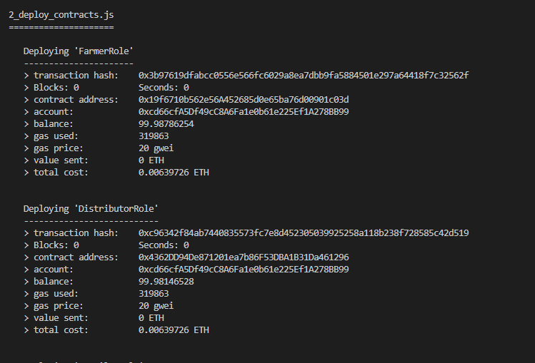
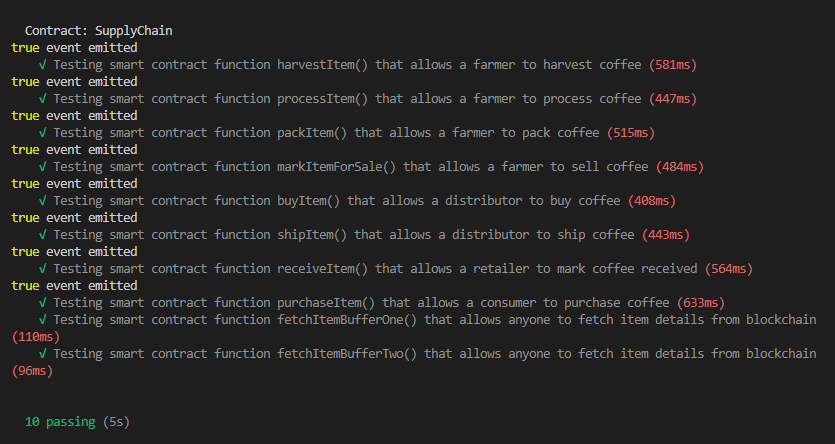
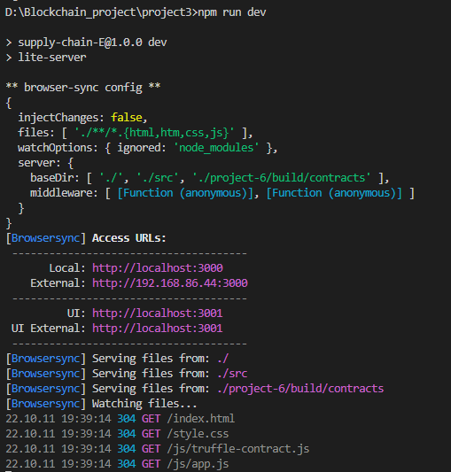
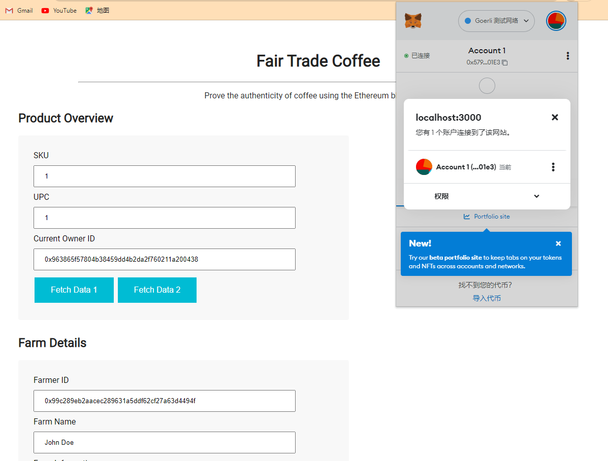

# Ethereum Dapp for Tracking Items through Supply Chain

## Summary
The final purpose of this project is to create a supply chain service by using blockchain. In this project, we create a DAPP on Ethereum using smart contract with role-based permission to track the production's life cycle. 

#### Sequence Diagram


## Initial the Ganache Client

Execute the Ganache Client in the Comment Prompt.


## Compile and Migrate the contract.




## Testing The dApp

Here is the result from the test by execute Truffle Test.


## NPM RUN DEV to initialize the local server. 

Here is the result from the test by execute Truffle Test.


## Running the dApp
Screenshots etc.


### Libraries Write-up
```json
"dependencies": {
    "solidity-docgen": "^0.5.7",
    "truffle": "^5.1.51",
    "truffle-assertions": "^0.9.2",
    "truffle-hdwallet-provider": "^1.0.17",
    "web3": "^1.3.0"
  }


### IPFS Write-up
In this project, I do use the IPFS. 

### General Write-up
There are several steps to finish this project.
- **Part 1 - Plan the project:**  It is necessary to construct an architecture using blockchain for supply chain. The most important thing is figure out the production's life cycle so that we would know what kind of relationship we need to build.
- **Part 2 - Write smart contracts:** Based on the architecture, I write different functions to satisfy the requirements and specific logic for different relationship and state transform.
- **Part 3 - Test smart contract code coverage:** By applying truffle test and construct the specific corner case, I could know are there any problem in the smart contract.
- **Part 4 - Deploy smart contracts on Rinkeby:** Since the Rinkeby has been deprecated by the Infura on 2022, I cannot deploy smart contract contracts on Rinkeby. I am looking forward some update from the Udacity context time for the Blockchain Nanodegree course. 
